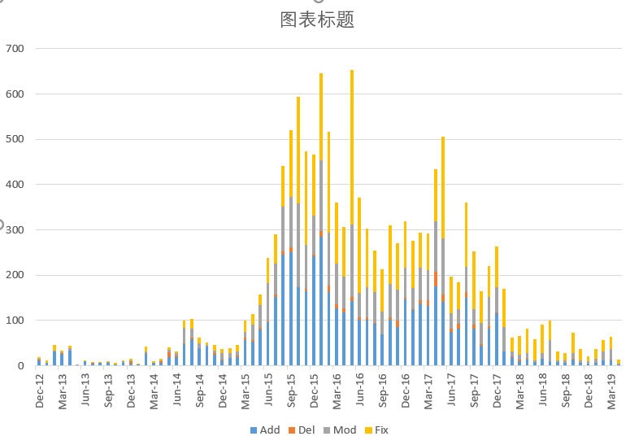

# Git-Repository-Miner-Codes
南京大学“开源仓库代码挖掘和可视化”创新项目代码

## 与前端交互的主类是： LaunchFunction/MainDataGenerator

***Remember to "git fetch origin master" and "git merge origin master" before your Modification!***

## 数据库一览

（1） ClassifiedCommitList+repoID

字段：Date [name1] [name2]....

元组示例：2019/5/5 1-8-5-6 3-5-5-2.....

字段中除Date外，为筛选过的项目LOC贡献最多的20个贡献者。

1-8-5-6代表Add-Del-Fix-Mod

（2）CommitTimesListByDay+repoID

字段：Date total [name1] [name2]....

元组示例：2019/5/5 600 50 100.....

字段中除Date和total外，为筛选过的项目LOC贡献最多的20个贡献者。

total代表当天commit总数

每个元素代表字段名对应贡献者在该日期的commit次数

（3）ContributorNetworkMatrix+repoID

字段：name [name1] [name2]....

元组示例：[name1] 0 1 3 4

字段中除name外，为筛选过的项目LOC贡献最多的50个贡献者。

每个元素为两人共同贡献的文件数量

整张表形似邻接矩阵

（4）FileContributorMatrix+repoID

字段：filename [name1] [name2]....

元组示例：readme.md 80 130 ....

字段中除filename外，为筛选过的项目LOC贡献最多的20个贡献者

filename中出现的文件为筛选过的LOC>1000的文件

每个元素的值为该贡献者在该文件上的LOC数量

（5）LOCSumLastCommit+repoID

**虽然名字是LOCSum，实际存的是Commit sum。**

字段：name commits lastcommittime

元组示例：MirageLyu 10 2019/5/11

这里，贡献者不做筛选，所有贡献者的相关信息都有

（6）OverallLOCList+repoID

字段：AuthorName LOC_Add LOC_Del

元组示例：MirageLyu 1636 368

这里贡献者同样不做筛选，所有贡献者都会出现

## 关于代码结构

刚刚更新的时候遇到了点问题，所以加了.gitignore把一些配置相关，还有target都ignore掉了。同时也因此注意到代码冲突带来的问题，所以为了减少耦合度，代码结构改了一下，大体逻辑是这样的：

- GitRepository：是一个记录git仓库的类，维护一个ContributorMap，后期主要传参对象
- ContributorMap：该类主要负责建立贡献者String和贡献者Contributor的索引，通过该类访问贡献者信息
- Contributor：记录贡献者的各种信息
- CommitMessages：记录格式化后的Commit的信息

把不同的功能最后写在不同的类里，传递一个共同的GitRepository，这样比较不会有merge时代码的冲突

不过其实就是改一下= =，原来的代码都可以正常跑的。刚刚看了一下，CalculateLOC功能已经变强大了，统计了很多东西，也许可以考虑用IDEA的重构功能改个名字之类的。考虑效率的话，CalculateLOC类里有对项目所有的Commit记录的遍历，可以直接用。而通过ContributorMap，可分别遍历每个贡献者的Commit记录，各取所需。

时间：14:52 By 白家杨
修改：加入LauchFunction包，每个功能对应一个类的static函数，这样启动信息直接可改

## 项目进度与统计

#### 一、实现功能：

- [x] 修改Main类中的文件名，根据文件名会自动下载对应仓库
- [x] 计算每个相邻commit的增加的行数和列数。
- [x] 显示每次commit的贡献者信息，包括名字、邮箱、提交的时间
- [x] 系统记录每个提交者的信息，对应成表
- [x] 系统记录每个提交者的LOC
- [x] 用户信息的保存成本地文件excel或csv
- [x] commit信息关键字的保存成本地文件D盘下命名为KeyWord.csv

#### 二、待修复的bug：

- [x] 最后删除下载的仓库时无法删除某些文件。（git.close()）

#### 三、需要完成的提高（任务分配）：

- [ ] Commit的条形码

- [ ] 代码结构的完善

- [ ] 图像的保存

- [ ] 保存用户邮箱信息

- [ ] 关键字的划分？

#### 四、完成的图表：
（1）每个Commit的关键词统计。参见CommitKeyWord包  
表格A：每个Commit的各个关键词，未来或用于贡献度计算。  
表格B：一个仓库随时间的Commit变化及关键词变化，未来或用于贡献度计算。  

(2)LOC的计算

